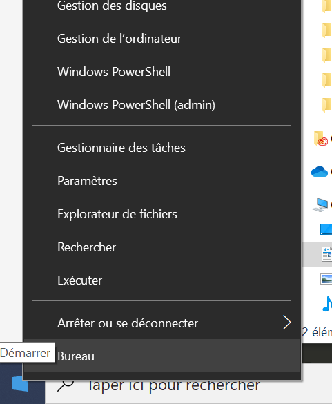
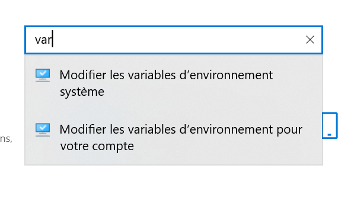
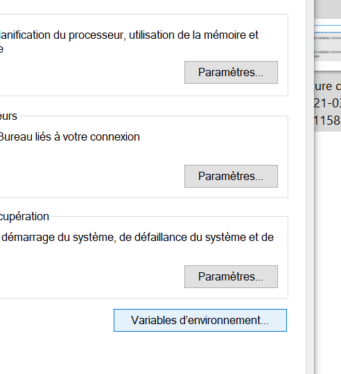
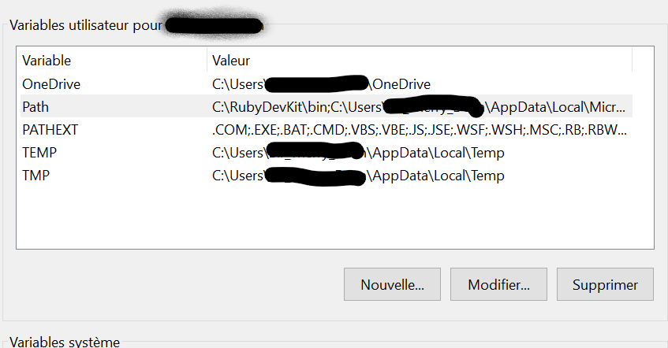
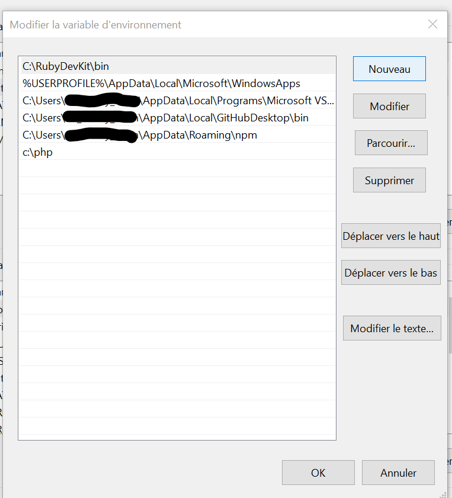

# Variable d'environnement

## Un peut d'histoire

Comme indiquer sur [Wikipedia]("https://fr.wikipedia.org/wiki/Variable_d'environnement"), sur windows c'est un élément majeur pour accéder à l'ensemble des programmes de votre ordinateur. Il existe depuis les premières versions Dos et Windows.

## En ligne de commande

Vous avez tout à fait la possibilité de rajouter le chemin dans votre console préférée (pour moi cmder) comme indiquer sur Wikipédia mais chaque fois que vous refermerez votre console et encore plus window, vous perdrez le changement effectué et donc le chemin de votre exécutable. C'est pour cela que je vais vous montrer comment l'intégrer dans l'initialisation de votre windows.

## Windows et la gestion des variables d'environnement système

### Accéder aux paramètres

1. Clic droit sur la fenêtre windows de démarrage sur votre écran
2. Puis clique droit sur paramètres pour accéder à l'interface des paramètres système.

### Accéder à l'interface des variables d'environnement

1. Tapez "var" dans la fenêtre de requête pour pouvoir cliquer sur "Modifier les variables d'environnement système"

### Les variables d'environnement système

1. A partir de là, cliquez en bas à droite sur le bouton [variables d'environnement]

### Accéder à la variable PATH

1. Double-cliqué sur la variable PATH pour être en "mode édition"

### Ajouter le chemin de votre répertoire

1. Cliquez sur le bouton [Nouveau]
2. Saisissez le chemin de l'exécutable ("point EXE") auquel vous souhaitez accéder à partir de n'importe quel répertoire de votre ordinateur.

Redémarer l'ordinateur et c'est prét. Il ne reste plus qu'à se mettre autour de la table pour consommer.

